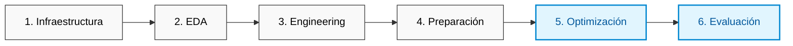

# Telecom Churn Prediction | Interconnect

[](https://www.python.org/)
[](https://scikit-learn.org/)
[](https://en.wikipedia.org/wiki/Receiver_operating_characteristic)

## 1. Introducción y Objetivos de Negocio

El objetivo estratégico de este proyecto es construir un sistema robusto de analítica predictiva capaz de identificar de manera proactiva el riesgo de abandono (*churn*) en la empresa de telecomunicaciones **Interconnect**. 

Al anticipar qué clientes planean cancelar sus servicios, el equipo de marketing digital podrá ejecutar campañas de retención quirúrgicas mediante códigos promocionales, incentivos financieros y planes de fidelización personalizados.

*   **Métrica Principal de Éxito:** $AUC-ROC \ge 0.88$ (Umbral requerido para despliegue productivo).
*   **Métrica Secundaria:** Exactitud (*Accuracy*).

---

## 2. Plan de Trabajo e Ingeniería de Software

Para garantizar la reproducibilidad científica y el rigor técnico, el pipeline se estructura en 6 fases secuenciales:



1.  **Aislamiento de Infraestructura (`tabular_classification`):** Implementación de un entorno virtual especializado en arquitecturas híbridas para datos tabulares (Gradient Boosting + Deep Learning acelerado por hardware).
2.  **Análisis Exploratorio de Datos (EDA):** Diagnóstico e integración multinivel de 4 silos de información (`contract`, `personal`, `internet`, `phone`) utilizando `customer_id` como llave primaria.
3.  **Ingeniería de Características:** Extracción del *target* (`churn`) a partir de la lógica temporal de contratos y cálculo de la variable predictora de ciclo de vida del cliente (*customer_lifetime*).
4.  **Preparación de Datos:** Mitigación de Fuga de Datos (*Data Leakage*), codificación avanzada de variables categóricas y partición estratificada (80/20).
5.  **Entrenamiento Iterativo y Modelado:** Benchmark competitivo que abarca desde modelos basados en la escuela lineal hasta ensambles avanzados y redes neuronales artificiales.
6.  **Evaluación Final:** Validación con un conjunto de prueba independiente, auditoría de la curva ROC, análisis de importancia de variables (*Feature Importance*) y traducción de métricas técnicas a valor financiero.

---

## 3. Entorno de Ejecución y Dependencias

Ejecuta los siguientes comandos en tu terminal para replicar el entorno exacto de este desarrollo:

```bash
# Creación y activación del entorno virtual con Conda
conda create -n tab_class python=3.11 -y
conda activate tab_class

# Instalación del stack científico basal
conda install -c conda-forge scikit-learn pandas numpy matplotlib seaborn -y

# Instalación de frameworks de Gradient Boosting y Deep Learning (Optimizado para Apple Silicon M1/M2/M3)
pip install lightgbm
pip install tensorflow==2.15.0 tensorflow-metal==1.1.0 keras-tuner
```

---

## 4. Diagnóstico Inicial y Análisis del Dataset (EDA)

Tras consolidar las fuentes independientes, se mapeó la siguiente realidad estructural:

*   **Integridad de Datos:** No se detectaron registros duplicados en ninguna de las dimensiones de negocio.
*   **Disparidad de Servicios:** Existe un desbalance natural en las suscripciones. La población base consta de **7,043 clientes**, de los cuales **5,517** cuentan con servicios de internet y **6,361** con telefonía activa.
*   **Distribución del Target:** El **73.46%** representa a clientes activos, frente a un **26.54%** de clientes en estado de abandono. Este desbalance de clases (proporción aproximada de 3:1) ratifica rigurosamente que la métrica de optimización primaria debe ser **AUC-ROC** en lugar de *Accuracy*.

---

## 5. Saneamiento Estructural Aplicado

Para garantizar la calidad de los datos antes del modelado, se ejecutaron las siguientes acciones de limpieza:

*   **Normalización Global:** Transformación completa del esquema de columnas a la nomenclatura estandarizada `snake_case` en minúsculas para evitar conflictos de sintaxis.
*   **Coerción Financiera:** La variable `total_charges` se transformó a tipo flotante continuo (`float64`). 
*   **Tratamiento de Nulos:** Se detectaron **11 registros vacíos** en la facturación total. Tras un análisis cruzado, se determinó que correspondían a clientes nuevos en su primer mes de ciclo de vida, por lo que se imputaron justificadamente con `0.0`.
